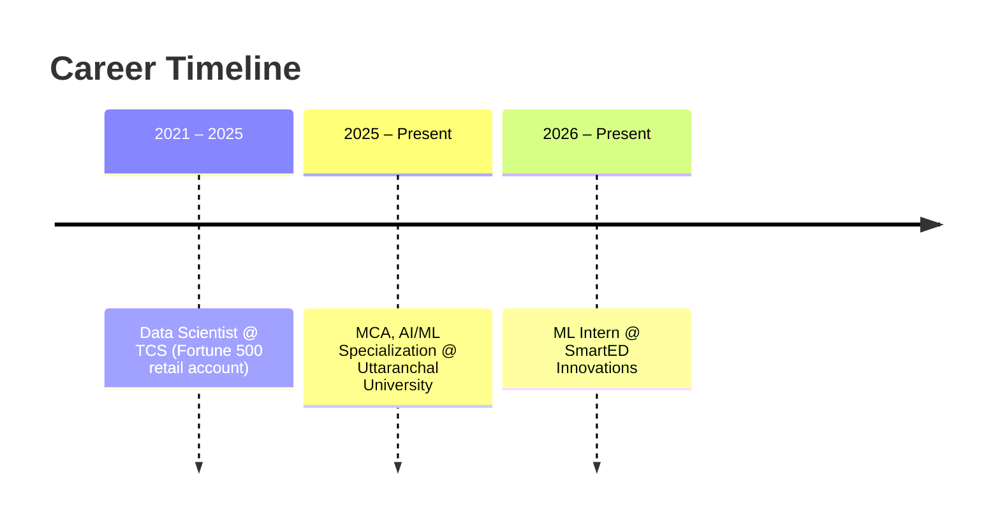

<div align="center">


<br/>


<br/>

<a href="https://bhimaiengineer.github.io/bhim-portfolio/">
  
</a>
<a href="https://linkedin.com/in/bhimaiengineer">
  
</a>
<a href="https://github.com/BhimAIEngineer">
  
</a>
<a href="https://kaggle.com/bhimaiengineer">
  
</a>
<a href="https://leetcode.com/bhim-rajbhar">
  
</a>
<a href="mailto:bhimrajbhar.ai.engineer@gmail.com">
  
</a>

<br/><br/>


<br/>


</div>


## 👨‍💻 About Me


Machine Learning Engineer / Data Scientist with **3.8 years of experience at TCS**, working on a Fortune 500 retail technology account across demand forecasting, NLP, and computer vision. Currently pursuing an **MCA specializing in AI/ML** at Uttaranchal University, and working as an **ML Intern at SmartED Innovations**.

I build complete, deployable ML systems rather than notebook-only experiments — each project ships with an API, containerization, and (where relevant) experiment tracking.

```
> "Code that ships, not code that stays in a notebook."
```

🔭 Currently building — **production ML systems for Data Scientist / ML Engineer role applications**
🌱 Currently learning — **Agentic AI, LangGraph orchestration, MLOps at scale**
👯 Looking to collaborate on — **computer vision, predictive maintenance & multi-agent LLM systems**
💬 Ask me about — **Python, ML/DL, NLP, CV, FastAPI, Docker, MLflow**
📫 Open to — **Data Scientist / Machine Learning Engineer roles**

<br clear="both"/>


## 📊 GitHub Analytics & Activity

<div align="center">


</div>

> 💡 For a live 3D contribution calendar, add [`profile-3d-contrib`](https://github.com/yoshi389111/github-profile-3d-contrib) as a GitHub Action — it will publish an SVG you can embed here.


## 🧩 LeetCode Stats

<div align="center">
<a href="https://leetcode.com/bhim-rajbhar">
  
</a>
</div>


## 🐍 Contribution Snake Game

<p align="center">
  <picture>
    <source media="(prefers-color-scheme: dark)" srcset="https://raw.githubusercontent.com/BhimAIEngineer/BhimAIEngineer/output/github-contribution-grid-snake-dark.svg" />
    
  </picture>
</p>

> 💡 Enable this with the [`snk`](https://github.com/Platane/snk) GitHub Action (`.github/workflows/snake.yml`) publishing to an `output` branch.


## 💼 Professional Experience



| Role | Organization | Duration | Focus |
|:---|:---|:---|:---|
| 🟢 **ML Intern** | SmartED Innovations (EdTech, remote) | Jun 2026 – Present | ML model training, data pipelines, NLP/LLM features |
| 🔵 **MCA, AI/ML Specialization** | Uttaranchal University | Aug 2025 – Present | Python, ML, Deep Learning, NLP, Data Viz |
| 🟣 **Data Scientist** | TCS — Fortune 500 retail technology account | ~3.8 yrs, ended Jul 2025 | Demand forecasting, NLP, computer vision |


## 🛠️ Featured Projects

<details open>
<summary><b>👥 <a href="https://github.com/BhimAIEngineer/churn-ltv-framework">Customer Churn & Cohort LTV Prediction</a></b></summary>
<br/>

End-to-end ML framework for customer churn prediction and cohort-based Customer Lifetime Value estimation, focused on segmentation, retention analysis, and data-driven business insights.

`Python` `Pandas` `NumPy` `Scikit-learn` `Matplotlib` `Seaborn` `Feature Engineering` `Churn Prediction` `Cohort Analysis` `LTV Modeling`
</details>

<details>
<summary><b>🧪 <a href="https://github.com/BhimAIEngineer/ab-testing-framework">Search Algorithm A/B Test — Impact Analysis Framework</a></b></summary>
<br/>

End-to-end experimentation framework for evaluating a new search ranking algorithm: statistical testing, experiment health checks, CUPED variance reduction, and interactive impact analysis.

`Python` `Pandas` `SciPy` `Streamlit` `A/B Testing` `CUPED` `SRM Analysis` `Bootstrap CI` `Chi-Square` `Welch's t-test` `Mann-Whitney U`
</details>

<details>
<summary><b>🏭 <a href="https://github.com/BhimAIEngineer/industrial-defect-detection">Industrial Defect Detection System</a></b></summary>
<br/>

Real-time computer vision system for catching manufacturing defects on the line before the part ships. Built with an object-detection pipeline, served via API, containerized, and tracked with an experiment-tracking layer — plus CI and a live dashboard.

`YOLOv8` `FastAPI` `Docker` `MLflow` `CI/CD` `Streamlit`
</details>

<details>
<summary><b>🏥 <a href="https://github.com/BhimAIEngineer/healthcare-triage-agent">Multi-Agent Healthcare Triage Assistant</a></b> — <i>in progress</i></summary>
<br/>

Cooperating LangGraph agents dividing triage work instead of a single monolithic prompt, combining image-based and tabular diagnosis into one system with explainable predictions.

`LangGraph` `Agentic Workflows` `LLM Orchestration` `SHAP`
</details>

<details>
<summary><b>✈️ <a href="https://github.com/BhimAIEngineer/predictive-maintenance-rul">Predictive Maintenance — Remaining Useful Life</a></b></summary>
<br/>

Remaining Useful Life prediction on NASA CMAPSS turbofan engine data, backed by a cost-simulation model showing the case for predictive over reactive maintenance.

`XGBoost` `LSTM` `FastAPI` `Streamlit` `Cost Simulation`
</details>

<details>
<summary><b>🩺 Disease Prediction & Medical Diagnosis System</b></summary>
<br/>

Production-grade system combining a CNN for image-based diagnosis with a custom ANN for tabular diagnosis, with explainability, an API layer, containerization, and CI.

`ResNet50` `Custom ANN` `SHAP` `FastAPI` `Docker` `MLflow` `GitHub Actions`
</details>

<br/>

## 🧰 Technical Skills

**Data Science / Classical ML**


**Deep Learning**


**NLP**


**Generative AI / Agents**


**Computer Vision**


**MLOps / Deployment**


**Cloud**


## 🎓 Education

| Degree | Institution | Year | Highlights |
|:---|:---|:---|:---|
| **MCA (AI/ML Specialization)** | Uttaranchal University | 2025 – Present | Python, ML, Deep Learning, NLP, Data Viz |


## 🌟 Let's Connect!

<div align="center">

I'm always open to **collaborations**, **mentorship**, or **exciting opportunities** — feel free to reach out!

<a href="mailto:bhimrajbhar.ai.engineer@gmail.com"></a>
<a href="https://linkedin.com/in/bhimaiengineer"></a>
<a href="https://github.com/BhimAIEngineer"></a>
<a href="https://kaggle.com/bhimaiengineer"></a>
<a href="https://leetcode.com/bhim-rajbhar"></a>

<br/>

**"Building complete, deployable ML systems — one project at a time." ✨**

</div>


